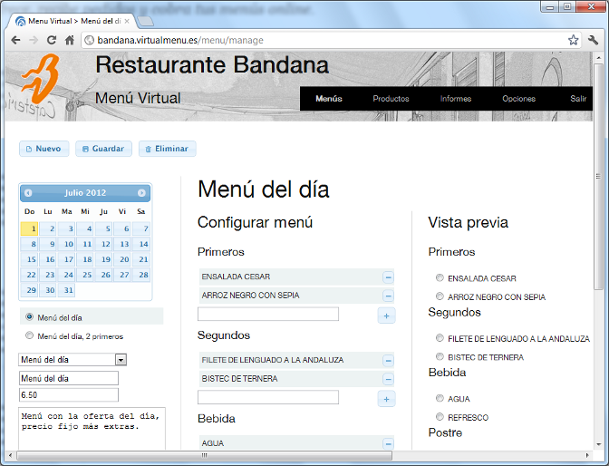

# VirtualMenu - Catering menu managment



VirtualMenu is a tool to manage daily menus, offer menus to clients and recieve orders.

## History and present

This was developed in the 2012's spring's weekends as a prove of concept for a restaurant willing to automatize part of their catering activity. The software was never used but it could be used, as is. A landing page with a compact list of it's functionalities can be seen at http://virtualmenu.casabesoft.com.

Now it's old, with outdated technologies, but could be improved progressively and become a useful and free tool for anyone managing a catering service serving regular menus.

## Setup

### Prerequisites

0. PHP >= 5.6
0. MySQL

### Dev tools

You can try doing it automatically running from the project base path:
```
$ bin/install.sh
```
If something goes wrong, try to install composer manually and then, from the project base path, run:
```
$ ./composer install
```

### Host name resolution

Edit the `hosts` file adding this line:
```
127.0.0.1 virtualmenu.dev
```

### DB config

0. From the project base path run:
```
$ ./composer run-script db-init
```
0. Setup a user access to the database by optionally:
  - Editing the "user" and "password" config in the file _www/application/config/database.php_, or
  - Creating the default MySQL user "virtualmenu" with password "virtualmenu" (which you should change, later) and giving access to the "virtualmenu" database, created in the first step.

### Running the server

From the project base path run:
```
$ ./composer run-script www
```

## Contributions

Every contribution is welcome. Even if you don't know how to contribute but have an idea to improve or extend the functionality, the ideas are welcome too.

On the other hand, if you want to contribute but don't know where to start, checkout the list of [open issues](https://github.com/CasabeSoft/virtualmenu/issues).

> Note: Right now we have a *strong need* to normalize the code base, cleaning dead code, commented fragments and change what is needed to reduce the amount of errors and warnings. See issue #11.

### Code conventions

Please, be sure to check your code fallows the project code conventions which is, as for now, a relaxed version of [PSR-2](http://www.php-fig.org/psr/psr-2/). You have two composer script for that:
```
$ ./composer run-script php-lint # For a summary port
$ ./composer run-script php-lint-full # For a full and detailed report
```
The objective is to have 0 errors and _ideally_ 0 warnings so, if you want to see the details of an specific file, look at the full report (see above) or specify the path to the file to analyze it along:
```
$ ./composer run-script php-lint-full path/to/your/file.php
```
Regarding documentation you:
  * *must* document every non trivial public element
  * *should* document every non trivial protected element
  * *can* optionally document private elements which complexity seems to require it.
